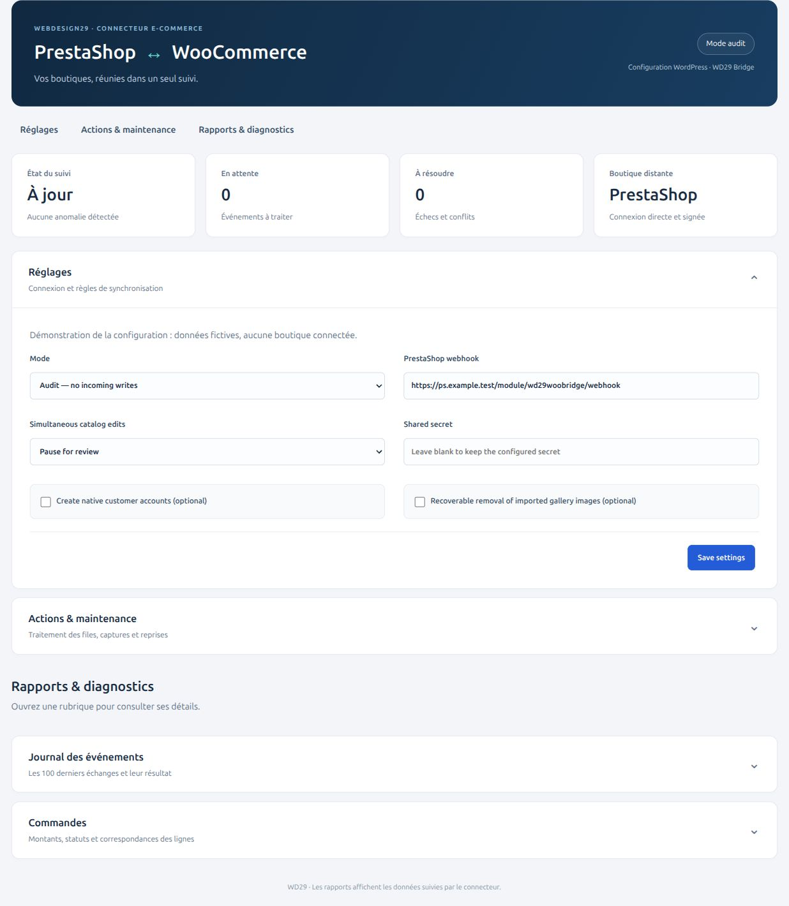

# WD29 WooCommerce Bridge

Synchronisation directe **WooCommerce ↔ PrestaShop** : catalogue, stocks, commandes et contacts clients, avec webhooks signés et file d’attente persistante.

**Version : 0.2.2 · candidate à recette.** Ce dépôt contient le plugin WooCommerce ; installez également le [plugin partenaire](https://github.com/webdesign29/prestashop-woocommerce-bridge).

[Télécharger les archives](https://github.com/webdesign29/woocommerce-prestashop-bridge/releases/tag/v0.2.2-rc.1) · [Exploitation et planificateur](OPERATIONS.md) · [Recette et limites](ACCEPTANCE.md)

## Aperçu de la configuration



*Capture de démonstration du composant réel de la version 0.2.2, rendu localement avec des données fictives et hors de l’administration hôte. Les domaines `example.test` sont fictifs ; le secret est vide. Aucun identifiant de connexion, jeton, compte client ou contenu de boutique réelle n’est utilisé. La sélection des champs est illustrative ; ce n’est pas une capture exhaustive du back-office.*

Le panneau regroupe les indicateurs d’état, les réglages de connexion, les actions de maintenance et les rapports repliables. Les tableaux défilants et les badges d’état facilitent la lecture des événements. Les formulaires conservent leurs contrôles d’autorisation et de validation.

## Ce qui est synchronisé

| Domaine | Comportement actuel |
| --- | --- |
| Catalogue | Produits simples et variables, descriptions, catégories, attributs, caractéristiques, marques/fabricant, étiquettes, prix et déclinaisons. Une marque WooCommerce maximum correspond au fabricant PrestaShop. |
| Identifiants et présentation | EAN/UPC/ISBN/MPN, identifiants complémentaires, dimensions converties via les centimètres, images de produits et déclinaisons, titres/descriptions SEO selon les correspondances prises en charge. |
| Stocks | Quantité initiale conservée, puis propagation des mouvements par écarts, avec verrous et déduplication. Un stock inconnu ne devient pas automatiquement zéro. |
| Commandes | Enregistrements natifs miroirs, totaux et lignes historiques, liens aux produits réparés ultérieurement si nécessaire, identités de lignes stables et correspondances de statuts. Les opérations financières restent sur la boutique d’origine. |
| Clients | Répertoire privé de contacts inscrits et invités, coordonnées et adresses source. Comptes natifs facultatifs, désactivés par défaut, avec mot de passe indépendant et sans fusion automatique par e-mail. |
| Métadonnées Woo / ACF | Liste explicite de champs autorisés et portées produit, déclinaison, commande ou client selon le type. Métadonnées de commandes HPOS prises en charge ; définitions ACF locales requises. [Contrat détaillé](CUSTOM-FIELDS.md). |
| Champs côté PrestaShop | Conservation privée et éditeur des valeurs déjà reçues pour produits, déclinaisons et commandes, avec protection contre les modifications concurrentes. Cela ne crée pas de champs KerAwen. |
| Fournisseurs | Fournisseur principal, références, coût d’achat HT et relations fournisseurs supplémentaires par produit/déclinaison. [Détails](SUPPLIERS.md). |
| Remboursements / avoirs | Copie du registre de la source pour consultation. Aucun second remboursement monétaire, document fiscal ou mouvement de remise en stock n’est déclenché. |
| Suppressions et images | Suppression définitive d’un produit source déjà lié : archivage du miroir, sans supprimer ses médias ni modifier son stock. Retrait des images importées facultatif et réversible depuis le panneau. [Galeries et restauration](GALLERY.md). |

### Identités et conflits

Chaque fiche conserve une identité d’origine, par exemple `woo:product:1001`. Les UGS vides et les adresses e-mail ne servent jamais à fusionner automatiquement des fiches. Le rapprochement initial conserve les produits propres à chaque boutique.

Pour le catalogue, choisissez une pause pour examen ou une priorité WooCommerce/PrestaShop, identique des deux côtés. Les conflits réels de commandes restent à examiner. L’action **Retry equivalent order updates** ne reprend que les ajouts techniques équivalents — champs nouveaux vides ou identifiants de lignes — après vérification des valeurs natives du miroir.

Les contacts se modifient sur leur boutique d’origine. Les mots de passe, rôles et consentements marketing existants ne sont pas transférés. La suppression d’un profil source efface ses coordonnées du répertoire miroir, sans effacer les adresses historiques des commandes ni supprimer son compte natif.

## Installation et mise en service

Installez `woocommerce-prestashop-bridge-0.2.2.zip` depuis **Extensions → Ajouter une extension → Téléverser**. Ouvrez **WooCommerce → PrestaShop Bridge** (`admin.php?page=wd29-bridge`).

1. Installez les deux plugins de la même version.
2. Configurez une même clé aléatoire d’au moins 32 caractères dans les réglages privés des deux boutiques. Ne la placez jamais dans un dépôt, une capture ou une URL.
3. Copiez le webhook affiché par chaque plugin dans le réglage de l’autre. Utilisez HTTPS, puis passez les deux boutiques en **audit** et lancez **Test connection**.
4. Vérifiez la fiscalité et la priorité du catalogue. La saisie des prix WooCommerce peut rester en **TTC**, avec une TVA correctement configurée. Une fiscalité manquante demande une base HT/TTC et un taux explicites ; le connecteur ne les devine pas.
5. Capturez les catalogues, puis les contacts et les historiques de commandes nécessaires. Les actions de capture travaillent par lots ; examinez les erreurs, les stocks inconnus et les lignes sans lien.
6. Effectuez la [recette](ACCEPTANCE.md), puis activez le mode **live**. En audit, les événements entrants sont reçus mais ne sont pas appliqués aux fiches, stocks et commandes.
7. Installez et vérifiez le worker sur l’hébergement, idéalement chaque minute sur chaque boutique, suivant [OPERATIONS.md](OPERATIONS.md). La présence du fichier CLI n’installe pas un planificateur. WP-Cron seul dépend des visites.

Les statuts PrestaShop inconnus sont créés dans WooCommerce avec leur identifiant et libellé d’origine. Le panneau WordPress permet de les associer à un statut WooCommerce existant, sans transformer cette correspondance en opération de paiement.

## Sécurité et exploitation

- Échanges HTTPS signés HMAC-SHA256, horodatage et protection contre le rejeu par identifiant de livraison.
- Files persistantes, reprises progressives, ordre de traitement par fiche et diagnostics. Une réception réussie ne garantit pas encore l’application native : vérifiez les deux panneaux.
- Configurations, données clients, correspondances et contenus des événements restent dans les bases privées des boutiques. Ne publiez pas d’export de ces tables.
- La désactivation conserve les correspondances et l’historique de déduplication. Ne réutilisez pas ces tables pour une autre paire de boutiques.
- N’activez les comptes natifs et les retraits de galeries qu’après avoir choisi ces comportements. Aucun rapprochement automatique avec un compte utilisant déjà le même e-mail.

## Limites et validation

**Ce connecteur n’est pas une certification KerAwen.** Les tests natifs WooCommerce/PrestaShop et les scénarios locaux de concurrence, rejeu et annulation ne remplacent pas une vente et un retour réalisés dans la caisse KerAwen réelle.

- Fidélité, cartes cadeaux, achats et champs privés KerAwen : contrat d’API pris en charge et recette dédiée nécessaires.
- Les mouvements de stock asynchrones convergent, mais ne réservent pas atomiquement le dernier article vendu simultanément sur les deux boutiques.
- Multiboutique, packs, téléchargements protégés, variantes génériques et stock mutualisé au parent demandent des adaptations spécifiques. Les quantités mixtes suivies/inconnues doivent être harmonisées.
- Écotaxe, devises incompatibles, fiscalité non mappée et écarts de frais/remises non expliqués peuvent bloquer une fiche ou une commande.
- Les définitions ACF ne sont pas copiées. Groupes, médias, relations vers produits synchronisés, taxonomies de catalogue existantes et traductions de structures complexes sont pris en charge selon le [contrat ACF](CUSTOM-FIELDS.md). Le stockage natif des champs **ACF PRO** reste à valider avec ACF PRO ; les tests de traduction utilisent des schémas synthétiques.
- La suppression/désactivation des comptes natifs n’est pas propagée automatiquement. Les remboursements financiers restent exécutés sur leur plateforme d’origine.

Voir [ACCEPTANCE.md](ACCEPTANCE.md) pour la liste des vérifications à effectuer dans l’environnement cible.

## Développement

```sh
php tests/protocol.php
python3 scripts/package.py
```

Test natif, **uniquement dans l’installation jetable prévue** :

```sh
WD29_WP_ROOT=/chemin/wordpress php tests/wordpress-integration.php
```

Les suites natives refusent les bases et domaines autres que leurs fixtures `wd29woo` / `wd29ps` et `woo.example.test` / `ps.example.test`. Certaines suites réinitialisent les tables du connecteur dans ces fixtures. Ne les lancez jamais sur une boutique client.

Les fichiers communs `includes/Protocol.php` et `includes/Engine.php` doivent rester identiques entre les deux dépôts. Le paquet ZIP est construit par liste explicite ; les fixtures et captures de documentation ne sont pas du code à installer sur les boutiques.

### Reproduire la capture sans données privées

```sh
php scripts/docs-preview.php > /tmp/wd29-documentation.html
```

Ce script CLI rend le composant de présentation avec une configuration fictive, sans charger WordPress, PrestaShop, une base de données ou un secret. Voir [la provenance des captures](docs/screenshots/README.md). Les captures ne représentent pas un état opérationnel réel.

## Évolutions récentes

- **0.2.2** : présentation commune des panneaux, indicateurs, rapports repliables, tableaux défilants et badges d’état.
- **0.2.1** : archivage des sources supprimées, galeries réversibles, contrôle des conflits techniques de commandes, ACF flexible et taxonomies de catalogue.
- **0.2.0** : champs personnalisés étendus, fournisseurs, registre des remboursements, comptes natifs facultatifs, lignes de commandes stables et diagnostics CLI.
